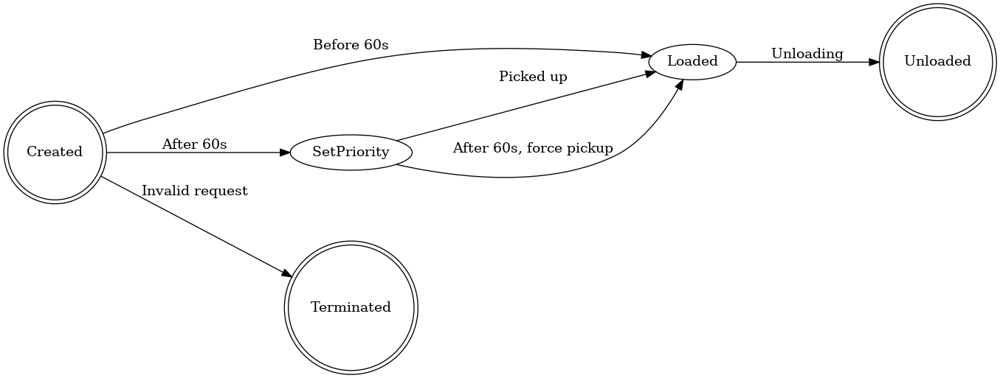
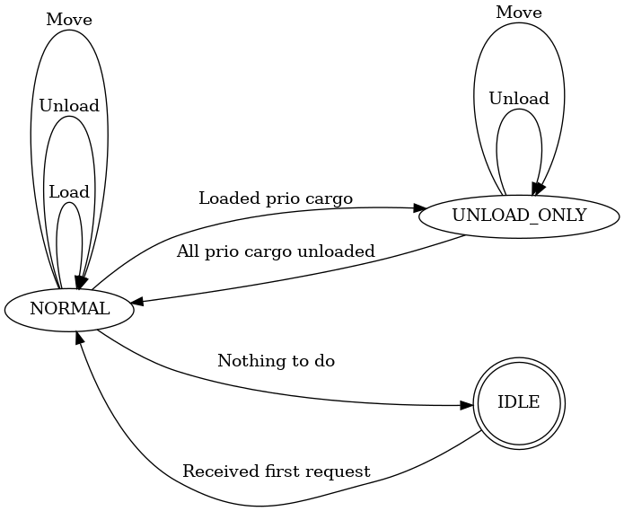
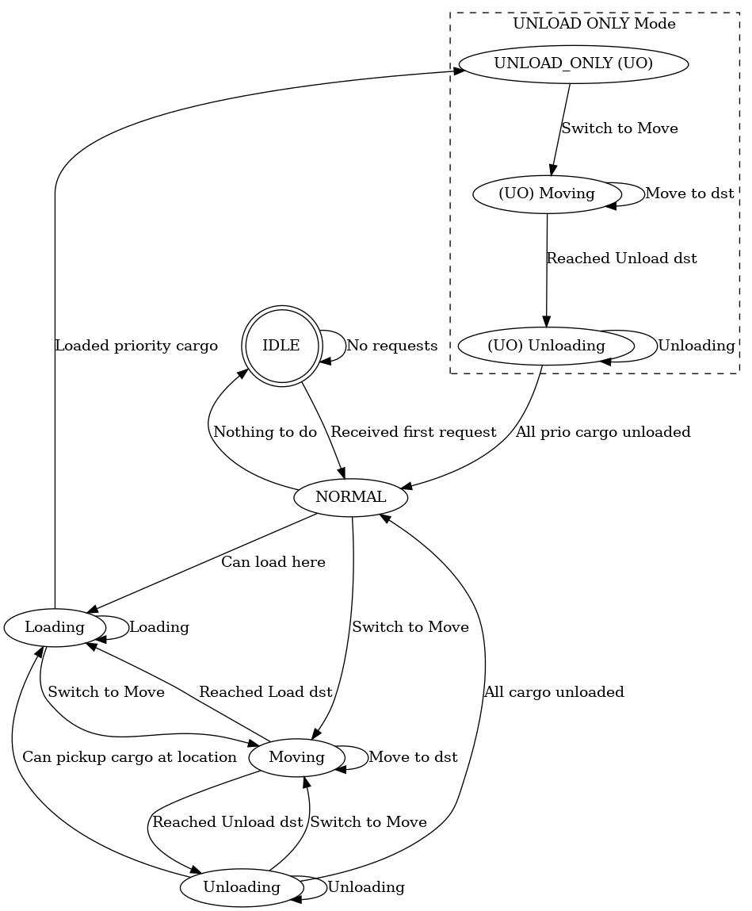

# 1. projektu ATA LS 2024/25 - Dokumentace testů
<!-- Tabulky nejsou formátované (korektní odskákání mezerami), protože kvůli dlouhým textům se stávají extrémně nepřehledné -->

### Autor: Bc. Adam Hos \<xhosad00>

## Nejasnosti/chyby ve specifikaci

#### Rozporu ve Specifikace chování:

> Požadavek "F-06 In unloading-only mode, the cart shall not perform any other loading or unloading except for priority cargo." Je v rozporu s "V tomto režimu (prioritní) vozík ignoruje jiné požadavky na převoz a zamíří přímo k cílové zastávce prioritního materiálu"

Dále je požadována jako korektní varianta chování, že vozík v režimu UNLOAD_ONLY bude skutečně pouze vykládat a jiný prioritní materiál nenaloží (tak jak je to v aktuální implementaci).
Pokud by byla tato domněnka špatná, tak by vzrostla sekce UNLOAD_ONLY Mode o nakládání prioritního materiálu a vykládání více než jednoho materiálu.

------

> "P-02 The cart shall respond to a priority request within 1 minute of its setting" je v rozporu s "F-10 The cart shall reject the cargo if all cart slots are occupied
or loading exceeds the maximum capacity." respektive případem, kdy materiál existuje přes 120s a vozík není na jeho stanici.

Není definováno, jak se má chovat. V implementaci jsou požadavky přes 120s zahazovány. Aktuálně algoritmus neupřednostňuje stanice, kde je prioritní materiál. Požadavek P-02 NEMŮŽE být garantován.

------

>C-06 The system shall communicate correctly with the factory’s external systems and respond to their requests.

SUT není takový externí systém a "factory" není SUT, tudíž tento požadavek není testován.

------

#### Nejasnosti:
>F-10 The cart shall reject the cargo if all cart slots are occupied
or loading exceeds the maximum capacity.

Není jasné, jestli se požadavek vztahuje na požadavek už při jeho vytvoření, nebo až při nakládání .

## Diagramy

Jednotlivé stavové diagramy:

> ### Stavový diagram nákladu
> 
> 
>
> Diagram popisuje stavy materiálu od prvotní žádosti až po vyložení nebo zahození požadavku. Požadavku je nastavena priorita po šedesáti sekundách. 
> 
> Problémový je ale případ, kdy přetrvá od nastavení dalších 60s. Ze specifikace chování: "Pokud takový materiál (prioritní) stále není naložen do další 1 minuty a vozík má volnou kapacitu, materiál se okamžitě naloží a vozík přepne do režimu pouze-vykládka." Pomiňuje ale fakt, že pokud vozík není v danné stanici, materiál se nemůže naložit.

> ### Stavový diagram CartCtl
> 
> 
>
> Diagram popisuje stavy CartCtl. Diagram je využit v několika testovacích cestách. Také slouží jako zjednodušený přehled stavů vozíku.

> ### Stavový diagram Vozíku
>
> 
> Seskupuje dohromady Cart a CartCtl. Figuruje jako hlavní graf pro tvoření testů.
> Jako počáteční stav má IDLE, ve kterém je, pokud nemá žádný aktivní požadavek nebo nevyložený náklad. Přechod do NORMAL proběhne, když je registrován požadavek. Zbytek grafu slouží pro plnění požadavků.
> * Loading - při provedení hrany `Loading` se naloží jeden materiál z aktuální stanice. Pokud je matirál prioritní, přepíná se do UNLOAD_ONLY režimu.
> * Moving - První přesun do Moving sám o sobě nedělá přesun vozíku. Stav tedy také figuruje jako spoj mezi stavy Loading a Unloading, i když se vozík nepřesune do jiné stanice. Až provedením hrany `Move to dst` se přesune do další dosažitelné stanice, která byla zvolena plánovacím algoritmem.
> * Unloading - při provedení hrany `Unloading` se vyloží jeden materiál z aktuální stanice.
> 
> Stavy Moving a Unloading v podgrafu UNLOAD ONLY Mode figurují stejně jako v normálním provozu, až na to, že při vyložení prioritního materiálu se hranou `All prio cargo unloaded` přesune do stavu NORMAL.

## Testovací cesty
Zvolené pokrytí: **Edge Coverage**
Cesta vždy patří k danému diagramu (specifikováno na začátku cesty).

| Id | cesta/uzly   | pokryté požadavky |
| :------------------ | :----------- | :---------------- |
| 1| Cargo: Created->Loaded | F-02|
| 2| Cargo: Created->Loaded->SetPriority |F-03|
| 3|Cargo: Created->SetPriority-(Picked up)>Loaded |F-04  |
| 4|Cargo: Created->SetPriority-(After 60s, force pickup)>Loaded |F-04  |
| 5|CartStatus: Loading->UNLOAD_ONLY (UO) |F-05 |
| 6|CartCtl: UNLOAD_ONLY->UNLOAD_ONLY |F-06 |
| 7|CartCtl: UNLOAD_ONLY->NORMAL |F-07 |
| 8|CartStatus: Moving->Moving |F-08|
| 9|CartStatus: Loading->Loading->Loading |F-09|
|10|CartStatus: Unloading->Unloading->Unloading |F-09|
|11|CartStatus: Loading->Loading->Moving->Unloading->Unloading |F-09|
|12|Cargo: Created->Terminated |F-10 C-05|
|13|CartStatus: IDLE->NORMAL |P-01|
|20|CartStatus: NORMAL->IDLE|-|
|21|CartStatus: NORMAL->Loading->Loading->Moving->Moving->Unloading->Unloading->Loading->Loading->Loading->Moving->Moving->Unloading->Unloading->Moving->Moving->Unloading->Unloading->NORMAL->IDLE|-|
|22|CartStatus: NORMAL->Moving->Moving->Loading|-|
|23|CartStatus: Loading->UNLOAD_ONLY (UO)->(UO) Moving->(UO) Moving->(UO) Unloading->(UO) Unloading->NORMAL|-|

Požadavky 20-23 slouží pro splnění kritéria **Edge Coverage**.

Je několik požadavků, které v cestách nejsou zahrnuty z následujících důvodů:
* F-01 - Neexistuje žádný modul, který by automaticky generoval nové požadavky.
* F-08 - Diagram nezahrnuje jednotlivé stanice a požadavky. Cesta splňující/vyvracující tuto vlastnost by byla nejasná.
* P-02 - [Rozporu ve Specifikace chování](#rozporu-ve-specifikace-chovani).
* C-01 až C-04 - Jsou testovány bez zpouštění simulace.

## Vstupní parametry testů

| Id | stručný popis |
| :---------------------- | :------------ |
| cartWeight | Maximální váha vozíku|
| slots| Počet slotů vozíku |
| cargoReq| Seznam n-tic reprezentující požadavek vytvořen ve formátu: [(src, dst, weight, name), ...]|
| reqTime|Seznam časů, kdy byli vytvořené požadavky |

## Tabulka testů

| Id |cartWeight|slots|cargoReq|reqTime| očekávaný výsledek (průběh daného testu) | pokryté test. cesty / požadavky |  testovací metoda |
| :--- | :------ | :------- | :---- |:---- |:---- |:---- |:---- |
|1|150 |4 |[('A','B',30,'broccoli'), ('B','C',100,'carrot'), ('C','A',10,'daikon'), ('C','D',20,'onion')]| [1, 2, 70, 90] | Kontrolér příjmá požadavky v daných časech, postupně je úspěšně plní (nakládá a vykládá ve správných stanicích) a žádný materiál se nestane prioritním.|1 8 9 13 20 21| test_happy_no_prio|
|2|150 |4 |[('B','D',150,'broccoli'), ('D','B',30,'carrot'), ('A','B',40,'daikon')]| [1, 2, 70] |Kontrolér příjmá požadavky v daných časech, postupně je úspěšně plní. Materiál `carrot` se stane prioritní. Po cestě na stanici vykládání `carrot` se nenaloží `daikon` kvůli UNLOAD_ONLY, i když má vozík volný slot a kapacitu a `daikon` je na cestě. |1 2 3 5 6 7 8 13 20 22 23| test_happy_prio|
|3|150 |4 |[('A','B',20,'broccoli'), ('B','A',30,'carrot'), ('B','D',40,'daikon')]| [1, 2, 3] |Testuje zda je cesta skutečně optimální (na lehkém příkladu).|8| test_optimize_total_path|
|4|150|4|[('B', 'C', 20, 'broccoli')]|[0]|Ověřuje, že kontroler zaregistruje požadavek do jedné sekundy.|P-01|test_time_req_1s|
|5|150|4|[('A', 'B', 20, 'broccoli')]|[0]|Ověřuje, že plánování cesty netrvá dále než jednu sekundu simulačního času.|P-03|test_time_pathing_1s|
|6|150|4|[('A', 'B', 20, 'broccoli')]|[0]|Ověřuje, že při naložení prioritního materiálu se v tentýž čas vozík přepne do režimu UNLOAD_ONLY.|P-04|test_time_Normal_\ to_UO_switch|
|7|150|4|[('A', 'B', 20, 'broccoli')]|[0]|Ověřuje, že při vyložení prioritního materiálu se do sekundy přepne do rrežimu NORMAL.|P-05|test_time_Normal_\ to_UO_switch|
|8|[50, 150, 500]|[0, 1, 2, 3, 4, 5]|-|-|Postupně zkouší kombinace vozíku. Když je zvolená špatná kombinace, očekává CartError.|C-01 C-03 C-04|test_cart_props_slots|
|9|2|[0, 1, 50, 99.9, 150, 200, 500, 501]|-|-|Postupně zkouší kombinace vozíku. Když je zvolená špatná kombinace, očekává CartError.|C-02|test_cart_props_weight|
|10|500|2|[('A','D',50,'broccoli'), ('A','D',1000,'bigBroccoli'), ('A','D',-1,'bigBroccoli')]|[0]|Vytvoří několik požadavků. U přidávání několika nevalidních požadavků očekává CartError.|12|test_cart_props_bad_req|

Názvy testů `test_time_Normal_to_UO_switch` a `test_time_Normal_to_UO_switch` jsou zalomeny kvůli šířce sloupce

Tastovací cesty jsou vždy přiřazeny alespoň k jednomu konkrétnímu testu. (Jednoduchá a časté cesty jsou pravděpodobně více testy, jen nejsou vypsané v tabulce)

### Patch - chyby v implementaci
Samotná implementace byla ponechána nepozměněna, zde je kolekce nejzávažnějších nalezených chyb.
1. Konstruktor vozíku nemá kvalitní kontrolu vstupu.
2. Práce s prioritním nákladem má nepřesnosti ve specifikaci a samotná implementace se odlišuje od požadavků. Hlavně mazáním záznamů které jsou v systému přes 120 sekund.
3. Funkce `find_load_there_single()` nepoužívá atribut priority.
4. UCS není dostatečně silný plánovací algoritmus pro splnění požadavků. (i když na této malé síti nepracuje špatně).
5. Pokud jsou dva  požadavky vytvořeny ve stejnou chvíly, je možná že nastane stavová výjmka vozíku.
6. Položky v sekci [Nejasnosti/chyby ve specifikaci](#nejasnostichyby-ve-specifikaci).

